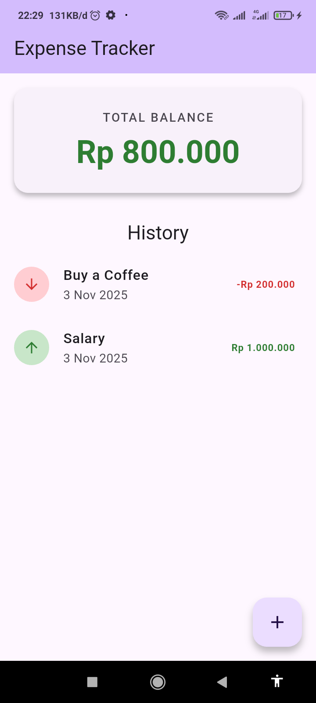

# Flutter Expense Tracker (Riverpod & Clean Architecture)

A simple, reactive expense tracker application built with Flutter. This project demonstrates a modern approach to state management for a transactional app using `flutter_riverpod` and persists data locally using `hive`.

This project was built as an assignment for a Mobile Device Programming course, focusing on implementing a robust, scalable, and testable app structure.

## App Demo



## 🚀 Features

- **Reactive State Management** : Built with `flutter_riverpod` (using `StateNotifierProvider` and `StateProvider`) for a clean separation of UI and business logic.
- **Local Persistence** : Uses **Hive**, a lightweight and fast NoSQL database, to store all transactions. Data persists even after the app is closed and restarted.
- **Clean Architecture** : Follows a layered architecture (Presentation, Domain, Data) to ensure the codebase is modular, scalable, and easy to maintain.
- **Full CRUD Functionality** :
  - **Create** : Add new income or expense transactions via a modal bottom sheet.
  - **Read** : View a list of all transactions, sorted by the most recent date.
  - **Delete** : Swipe-to-delete functionality on any transaction item.
- **Real-time Balance Calculation**: The "Total Balance" card is a computed state that updates instantly as transactions are added or deleted.
- **Async State Handling** : Gracefully handles `loading`, `error`, and `data` states in the UI using Riverpod's state models.
- **Form Validation** : Client-side validation for the new transaction form.
- **Localization (intl)** : Formats dates and currency for the `id_ID` (Indonesian) locale.

## 🏛️ Project Architecture

This project follows a simplified Clean Architecture pattern, which strictly separates concerns into three layers.

1.  **Presentation Layer** : Contains all UI-related components (Widgets, Screens) and the State Management logic (Notifiers, Providers). It is concerned with _what_ the user sees and _how_ they interact with it.
2.  **Domain Layer** : The core of the application. It contains the business logic, entities (pure Dart objects), and the abstract `Repository` interfaces. This layer is completely independent of the UI and data sources.
3.  **Data Layer** : Responsible for all data operations. It contains the `Repository` implementations, `Data Sources` (which talk directly to Hive), and data `Models` (which include Hive-specific annotations).

### Data Flow & Dependency Injection

Riverpod is used to provide dependencies (DI) and manage state, adhering to the architecture's rules:

+--------------------------+ | Presentation (UI) | | (HomeScreen, Widgets) | | (Watches Notifier) | +-------------|------------+ ↓ +--------------------------+ | Presentation (State) | | (TransactionNotifier) | | (Injects Repository) | +-------------|------------+ ↓ +--------------------------+ | Domain (Interface) | | (TransactionRepository) | +-------------|------------+ ↓ +--------------------------+ | Data (Implementation) | | (TransactionRepoImpl) | | (Injects Data Source) | +-------------|------------+ ↓ +--------------------------+ | Data (Source) | | (TransactionLocalSource) | | (Talks to Hive) | +--------------------------+

## 📁 Folder Structure

The project uses a feature-first folder structure combined with architectural layers.

lib/ ├── features/ │ └── transactions/ │ ├── data/ │ │ ├── constants.dart │ │ ├── data_sources/ # Interface and Impl for data source │ │ ├── models/ # TransactionModel (with Hive annotations) │ │ └── repositories/ # TransactionRepositoryImpl (maps Model <-> Entity) │ │ │ ├── domain/ │ │ ├── entities/ # Transaction (pure Dart object) │ │ └── repositories/ # TransactionRepository (Interface/Contract) │ │ │ └── presentation/ │ ├── notifiers/ # TransactionNotifier (StateNotifier) │ ├── providers/ # All Riverpod providers │ ├── screens/ # HomeScreen │ └── widgets/ # Reusable widgets (form, list, etc.) │ └── main.dart # App entry point, Hive & Intl initialization

## 🚀 Getting Started

To run this project locally, follow these steps:

1.  **Clone the repository :**

    ```bash
    git clone https://github.com/bugkey24/flutter_expense_tracker_riverpod.git
    cd flutter_expense_tracker_riverpod
    ```

2.  **Install dependencies :**

    ```bash
    flutter pub get
    ```

3.  **Run the code generator (for Hive) :**
    This is a mandatory step to generate the `*.g.dart` adapter files.

    ```bash
    flutter pub run build_runner build --delete-conflicting-outputs
    ```

4.  **Run the application :**
    ```bash
    flutter run
    ```

## 📄 License

This project is licensed under the MIT License.
